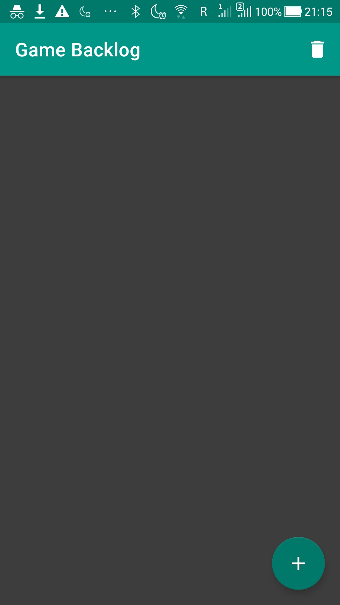
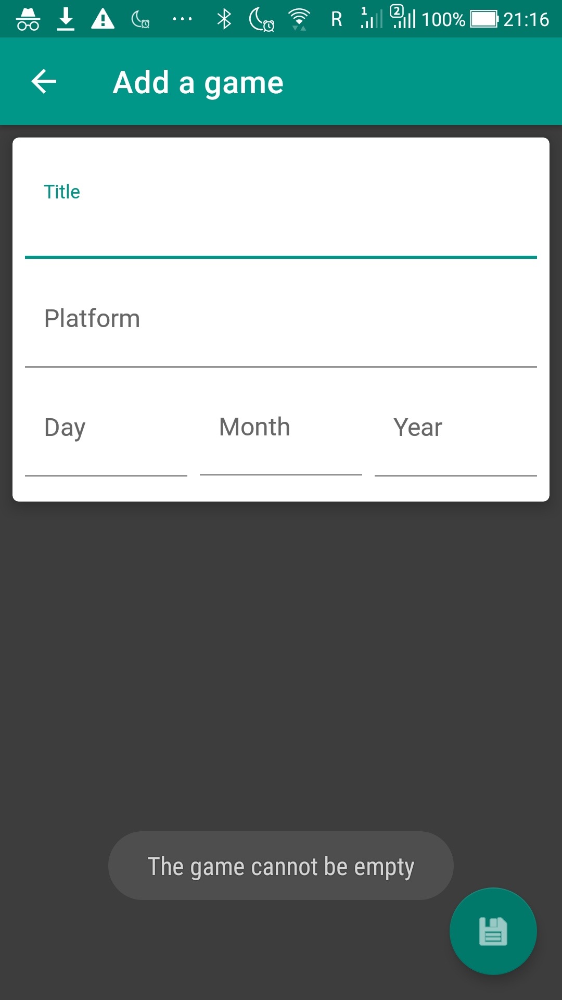
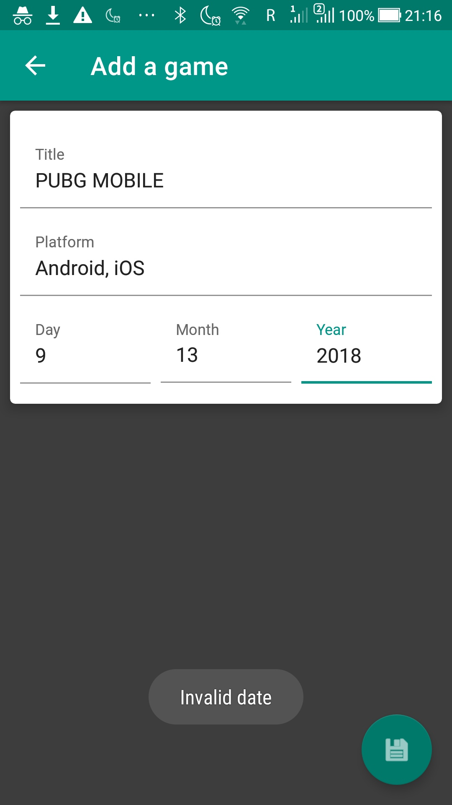
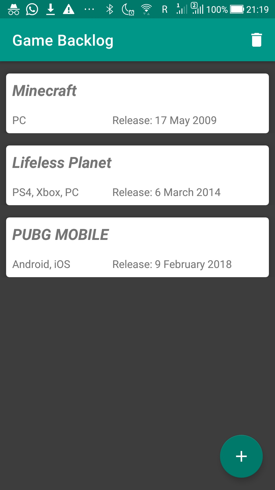
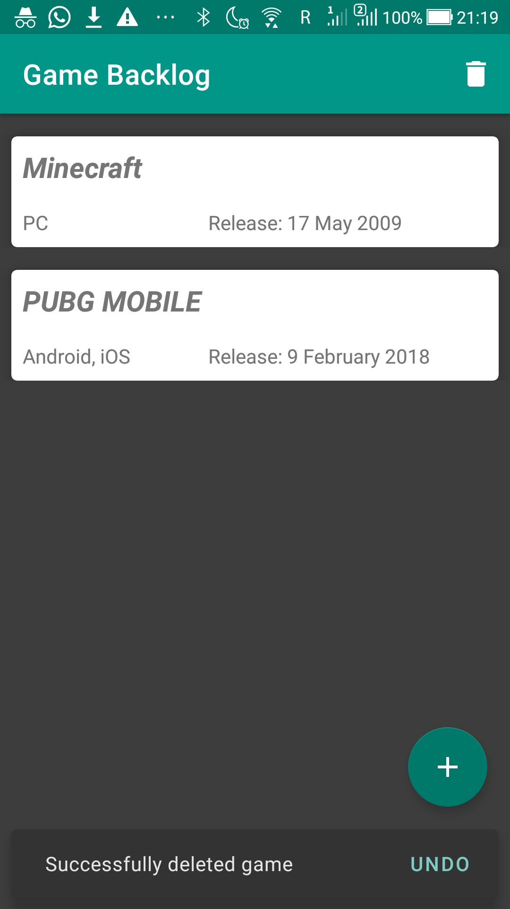
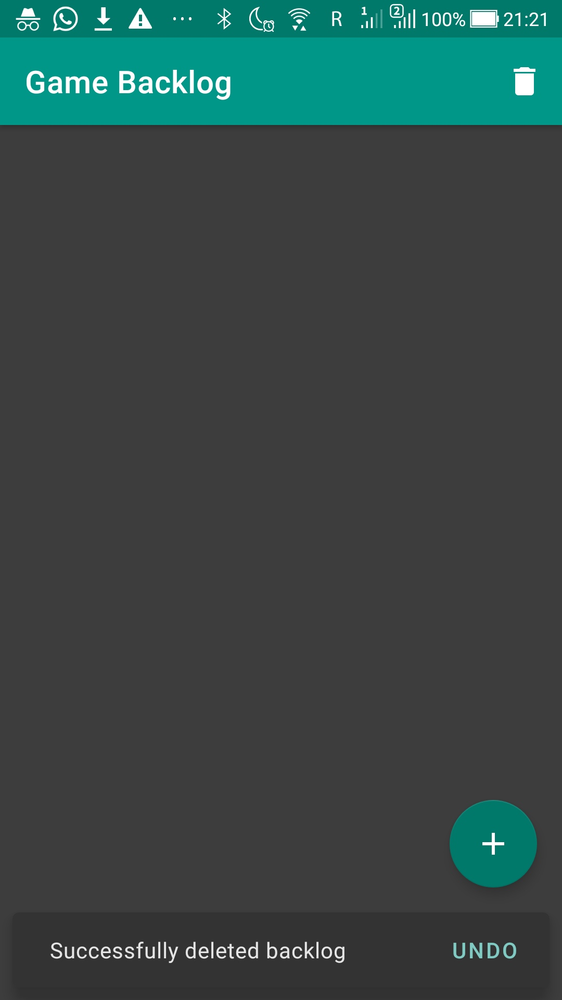

# Level 5 Learning Task 2 - Game Backlog
This is an application where you can keep track of which new games you want to play.
## What's inside
* The games are locally stored (Room).
* MVVM Architecture is used using the Architecture Components (ViewModel, LiveData).
* A game consists of a title, platform and a release date. 
* The games are shown using a MaterialCardView widget (this is included in the material widgets dependency).
* The games are shown in the order of release date (first game to be released is at the top).
* You can add games.
* You can remove games by swiping the game to the left.
* You can remove all games at once by clicking the garbage bin in the toolbar.

Also:

* Errors are handled in the AddActivity form and the user is informed (fields must not be empty and a valid date must be filled in).
* A snack bar message is displayed in which the user has a few seconds to undo the deletion of the game(s).
## Screenshots
    
    
    
